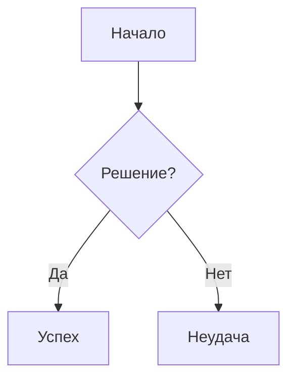
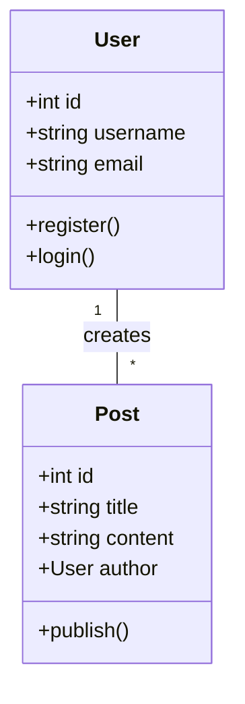
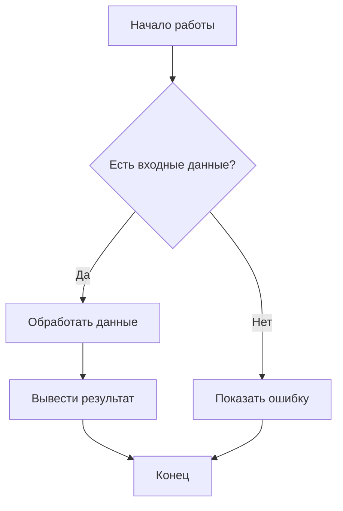

### 1 Что такое Software 1.0?
**Software 1.0** — это традиционная парадигма программирования, где разработчики вручную пишут каждую строку кода на языках вроде C++, Python или Java. Программы работают по явно заданным правилам, которые программист детально прописывает.

**a. Назовите примеры Software 1.0.**
- Операционные системы (Windows, Linux)
- Веб-серверы (Apache, Nginx)
- Банковские системы
- Драйверы устройств
- Компиляторы и интерпретаторы

**b. Почему Software 1 детерминирован?**
Потому что каждая строка кода представляет собой явную инструкцию для компьютера. При одинаковых входных данных программа всегда производит одинаковые результаты. Нет вероятностных элементов или обучения на данных.

**c. Какой главный компонент Software 1.0?**
**Явный алгоритмический код**, написанный разработчиком в виде точных инструкций, условных операторов, циклов и структур данных.

### 2 Что такое Software 2.0?
**Software 2.0** — это парадигма, где функциональность кодируется не как явные инструкции, а как обученные параметры (веса) нейронных сетей, натренированных на больших датасетах.

**a. Назовите примеры Software 2.0.**
- Система Tesla Autopilot
- Распознавание лиц в смартфонах
- Рекомендательные системы (YouTube, Netflix)
- Машинный перевод (Google Translate)
- Голосовые помощники (Siri, Alexa)

**b. Назовите инструменты Software 2**
- **Фреймворки:** PyTorch, TensorFlow, JAX
- **Библиотеки:** Hugging Face Transformers, Scikit-learn
- **Архитектуры:** CNN (сверточные нейронные сети), RNN, Transformer

**c. Почему Software 2 не детерминирован?**
Потому что нейронные сети работают на основе вероятностных вычислений. Даже при одинаковых входных данных могут быть небольшие вариации в результатах из-за стохастической природы обучения и вывода. Кроме того, модели могут генерировать разные варианты ответов.

**d. Какой главный компонент Software 2.0?**
**Обученные веса нейронной сети** — миллионы/миллиарды параметров, которые кодируют знания модели, полученные из данных, а не из явных инструкций.

### 3 Что такое Software 3.0?
**Software 3.0** — это новейшая парадигма, где большие языковые модели (LLM) программируются через естественный язык. Как отметил Карпатый: "LLM — это новый вид компьютеров, и вы программируете их на английском языке".

**a. Назовите инструменты Software 3.0.**
- **AI-IDE:** Cursor, Windsurf
- **Генераторы приложений:** Lovable, Bolt.new, V0.dev
- **AI-ассистенты:** GitHub Copilot, Tabnine, Amazon Q Developer
- **Агентные системы:** Devin AI, Claude Code, Gamma

**b. Какой главный компонент Software 3.0?**
**Естественный язык как интерфейс программирования** — способность описывать желаемое поведение программы на человеческом языке, который LLM преобразует в код.

**c. Является ли Software 3 предсказуемым?**
**Нет, не полностью.** Software 3.0 менее предсказуем, чем Software 1.0, из-за вероятностной природы LLM. Модели могут генерировать разные результаты для одинаковых промптов, особенно при ненулевой температуре. Однако качественные промпты и параметры настройки могут повысить предсказуемость.

### 4 Могут ли все парадигмы существовать вместе?
**Да, все три парадигмы могут и будут сосуществовать.** Карпатый подчеркивает, что каждая парадигма оптимальна для своих задач.

**a. Как разработчик может использовать все три парадигмы в одном приложении?**
1. **Software 1.0:** Для критически важных компонентов, требующих детерминизма (например, аутентификация, обработка платежей)
2. **Software 2.0:** Для задач распознавания паттернов (например, рекомендации, классификация изображений)
3. **Software 3.0:** Для интерфейсов на естественном языке, генерации контента, помощи в разработке

**Пример:** Веб-приложение электронной коммерции:
- Software 1.0: Система заказов и инвентаризации
- Software 2.0: Рекомендательная система продуктов
- Software 3.0: Чат-бот поддержки, генерация описаний продуктов

**b. Какой подход вы выберете для написания системы контроля доступа (логин/пароль) и почему?**
**Software 1.0**, потому что:
- Требуется 100% детерминизм и надежность
- Безопасность критически важна, нужен полный контроль над логикой
- Предсказуемость обязательна (одинаковые учетные данные всегда должны давать одинаковый результат)
- Алгоритмы хеширования и верификации хорошо определены и стандартизированы

### 5 В чем главное отличие Software 1 от Software 2.0?
**Главное отличие:** Способ кодирования функциональности:
- **Software 1.0:** Явный код, написанный разработчиком
- **Software 2.0:** Обученные параметры нейронной сети

**a. Почему Software 1 плохо для распознавания паттернов?**
Потому что разработчику пришлось бы вручную прописывать все возможные варианты и исключения, что непрактично для сложных, многомерных паттернов (например, распознавание лиц, понимание естественного языка).

**b. Почему Software 2 хороша для больших данных?**
Потому что нейронные сети могут:
1. Автоматически извлекать признаки из данных
2. Масштабироваться с ростом объема данных
3. Обобщать на основе примеров, а не явных правил
4. Обнаруживать сложные, нелинейные зависимости

### 6 Какая парадигма лучше для web-приложений?
**Для разных частей веб-приложений подходят разные парадигмы:**

**Современный подход:**
- **Software 1.0:** Бэкенд-логика, базы данных, API
- **Software 2.0:** Рекомендательные системы, классификация контента
- **Software 3.0:** Интерфейсы чат-ботов, генерация контента, AI-ассистенты

**a. Может ли Software 3 полностью заменить Software 1 для веб-приложений?**
**Нет, в обозримом будущем.** Причины:
1. **Надежность:** Software 1.0 более предсказуем и надежен
2. **Безопасность:** Критически важные системы требуют полного контроля
3. **Производительность:** Традиционный код обычно эффективнее
4. **Отладка:** Проще отлаживать явный код, чем поведение LLM

### 7 Когда использование Software 3 может быть рискованным в production системе?
**Рискованные сценарии:**
- Критически важные системы (банковские операции, медицинское оборудование)
- Системы, где ошибки могут привести к серьезным последствиям
- Области с жесткими регуляторными требованиями
- Системы, требующие полной воспроизводимости и аудита

**a. Назовите один минус Software 3.0, который нельзя решить никаким prompting'ом**
**Фундаментальная недетерминированность** — даже с идеальным промптом LLM остаются вероятностными системами, которые могут генерировать разные результаты в разных запусках. Это связано с архитектурой трансформеров и процессом генерации токенов.

### 8 Дайте один пример Software 2 и один пример Software 3.0.
**Software 2.0:** **Система распознавания лиц в iPhone** — использует нейронные сети, обученные на миллионах изображений, чтобы идентифицировать владельца.

**Software 3.0:** **GitHub Copilot** — использует LLM для генерации кода на основе естественно-языковых описаний и контекста.

**a. Почему Software 3 более универсален, чем Software 2**
Потому что Software 3.0:
1. **Единый интерфейс:** Работает с естественным языком вместо специализированных архитектур
2. **Широкий охват задач:** Может решать задачи из разных доменов без переобучения
3. **Few-shot/zero-shot обучение:** Справляется с новыми задачами без дополнительного обучения
4. **Инструктивное выполнение:** Выполняет разнообразные команды через промпты

---

## РАЗДЕЛ 2: GIT И GITVERSE

### 9 Что такое Git?
**Git** — распределенная система контроля версий, созданная Линусом Торвальдсом в 2005 году. Позволяет отслеживать изменения в коде, работать с ветками и сотрудничать в командах.

**a. В чем разница между Git и GitHub?**
- **Git:** Локальная система контроля версий (инструмент командной строки)
- **GitHub:** Веб-платформа для хостинга Git-репозиториев с дополнительными функциями (issues, pull requests, actions)

**b. Что такое GitVerse?**
**GitVerse** — российская платформа для совместной разработки от СберТеха, запущенная в 2024 году. Ориентирована на импортозамещение и включает AI-ассистент GigaCode.

**c. В чем отличие GitVerse от GitHub с точки зрения разработчика?**
1. **Локализация:** GitVerse полностью на русском, ориентирована на российский рынок
2. **AI-интеграция:** Встроенный AI-ассистент GigaCode для помощи в разработке
3. **Правовые аспекты:** Соответствие российскому регулированию
4. **Бесплатные квоты:** Щедрые бесплатные лимиты для разработчиков
5. **Импортозамещение:** Альтернатива зарубежным платформам

### 10. Назовите три состояния файла в Git.
1. **Modified (измененный):** Файл изменен, но не добавлен в staging area
2. **Staged (подготовленный):** Файл добавлен в индекс для следующего коммита
3. **Committed (закоммиченный):** Файл сохранен в локальной базе данных Git

**a. Что делает `git add`?**
Добавляет изменения из рабочей директории в staging area (индекс) для подготовки к коммиту.

**b. Что делает `git commit`?**
Создает снимок изменений из staging area и сохраняет его в локальную базу данных Git с сообщением.

**c. Что делает `git status`?**
Показывает состояние рабочей директории и staging area: какие файлы изменены, добавлены, удалены.

### 11. Что такое ветка (branch)?
**Ветка** — это подвижный указатель на коммит, позволяющий вести параллельную разработку. Каждая ветка представляет отдельную линию разработки.

**a. Когда вы должны создать новый branch вместо работы в main?**
- При начале работы над новой функцией
- При исправлении бага
- При экспериментировании с новым подходом
- При работе над разными версиями продукта

**b. Что означает HEAD в Git?**
**HEAD** — это указатель на текущую ветку или конкретный коммит. Обычно указывает на последний коммит в текущей ветке.

### 12. Объясните, в чем разница между `commit` и `push` в Git.
- **`git commit`:** Сохраняет изменения в локальном репозитории
- **`git push`:** Отправляет локальные коммиты на удаленный репозиторий (GitHub/GitVerse)

**a. Объясните кратко, чем rebase отличается от merge.**
- **`merge`:** Создает новый коммит слияния, сохраняя историю обеих веток
- **`rebase`:** Перемещает коммиты одной ветки на конец другой, создавая линейную историю

### 13. Что происходит при merge двух branches, которые изменили одну и ту же строку?
Возникает **конфликт слияния (merge conflict)** — Git не может автоматически определить, какое изменение использовать.

**a. Что такое merge conflict?**
Ситуация, когда Git не может автоматически разрешить различия между ветками, так как были изменены одни и те же строки в одном файле.

**b. Как разрешить merge conflict?**
1. Открыть файл с конфликтами
2. Найти маркеры конфликта (`<<<<<<<`, `=======`, `>>>>>>>`)
3. Вручную выбрать нужные изменения или объединить их
4. Удалить маркеры конфликта
5. Выполнить `git add` и `git commit` для завершения слияния

### 14. Как настроить branch protection в GitVerse, чтобы нельзя было push'ить напрямую в master?
В GitVerse (как и в GitHub):
1. Перейти в настройки репозитория
2. Найти раздел "Branches" или "Защита веток"
3. Добавить правило для ветки master/main
4. Включить опции:
   - Require pull request reviews before merging
   - Require status checks to pass
   - Include administrators

**a. Как создать новую ветку?**
```bash
git checkout -b feature/new-feature
```
или через GitVerse интерфейс.

**b. Когда удаление веток (branches) актуально и зачем?**
- После слияния feature-ветки в main
- Для очистки устаревших веток
- Чтобы избежать путаницы в больших проектах

**c. Как переключиться на другую ветку?**
```bash
git checkout branch-name
```
или
```bash
git switch branch-name
```

### 15. Что такое pull request (PR)?
**Pull Request (PR)** — запрос на слияние изменений из одной ветки в другую. Позволяет провести code review перед слиянием.

**a. Почему Pull Request важен при работе в команде?**
1. **Code review:** Коллеги могут проверить код на ошибки
2. **Обмен знаниями:** Команда учится друг у друга
3. **Качество кода:** Стандартизация и соблюдение best practices
4. **Документация:** Обсуждение решений сохраняется в истории

**b. Кто может быть reviewer при code review и почему важно разнообразие reviewers?**
**Reviewer'ами** могут быть:
- Коллеги по команде
- Техлиды
- Специалисты по безопасности

**Разнообразие важно**, потому что:
1. Разные перспективы выявляют разные проблемы
2. Снижается risk bias
3. Распределяются знания по команде
4. Повышается общее качество кода

### 16. Что такое `.gitignore` и какие файлы обычно в нем указывают?
**`.gitignore`** — файл, указывающий Git, какие файлы и директории игнорировать (не добавлять в репозиторий).

**a. Назовите типичные файлы в `.gitignore`.**
```
# Зависимости
node_modules/
vendor/
.env

# Системные файлы
.DS_Store
Thumbs.db

# IDE файлы
.vscode/
.idea/
*.swp

# Логи и временные файлы
*.log
tmp/
temp/

# Сборки
dist/
build/
*.exe
```

---

## РАЗДЕЛ 3: CI/CD И YAML

### 17. Почему нужна CI/CD автоматизация?
**CI/CD автоматизация** нужна для:
- Ускорения процесса разработки и доставки
- Снижения человеческих ошибок
- Обеспечения качества кода
- Быстрого обнаружения и исправления багов

**a. Что означает CI?**
**Continuous Integration (Непрерывная интеграция)** — практика частого слияния кода в основную ветку с автоматическим тестированием.

**b. Что означает CD?**
**Continuous Deployment/Delivery (Непрерывное развертывание/доставка)** — автоматический деплой протестированного кода в продакшн.

**c. Какими инструментами CI/CD мы пользовались в течении семестра**
- **GitHub Actions** / **GitVerse Actions**
- **YAML** для конфигурации workflow
- Автоматические тесты и проверки

### 18. Назовите основные блоки YAML файла для GitHub/GitVerse Actions workflow.
```yaml
name: Workflow Name        # Название workflow
on: [push, pull_request]   # Триггеры (события)
jobs:                      # Задачи
  build:                   # Имя задачи
    runs-on: ubuntu-latest # Окружение
    steps:                 # Шаги задачи
    - uses: actions/checkout@v2
    - name: Run tests
      run: npm test
```

**a. Где как правило хранится файл с описанием действий**
В директории `.github/workflows/` или `.gitverse/workflows/` в корне репозитория.

**b. Какое название этого файла для домашних работ**
Обычно `ci.yml`, `tests.yml` или что-то специфичное, например `homework-check.yml`.

### 19. На какие события может реагировать workflow?
- `push` — push в репозиторий
- `pull_request` — создание/обновление pull request
- `schedule` — по расписанию (cron)
- `workflow_dispatch` — ручной запуск
- `release` — создание релиза

**a. Что такое job в workflow?**
**Job** — набор шагов, которые выполняются на одном runner'е. Может содержать несколько steps.

**b. Что такое step в workflow?**
**Step** — отдельная задача в job (например, checkout кода, установка зависимостей, запуск тестов).

### 20. Что такое runner в GitHub/GitVerse Actions?
**Runner** — сервер, который выполняет workflow. Может быть:
- **GitHub-hosted:** Предоставляемые GitHub/GitVerse
- **Self-hosted:** Настраиваемые пользователем

**a. Что означает `runs-on: ubuntu-latest` и когда выбрать другую ОС?**
Использует последнюю версию Ubuntu. Другую ОС выбирать, когда:
- Нужна специфичная ОС (Windows для .NET, macOS для iOS development)
- Требуются определенные инструменты или драйверы
- Тестирование кроссплатформенной совместимости

### 21. Какие основные ошибки при написании CI/CD конфига?
1. Неправильные отступы в YAML
2. Отсутствие обработки ошибок
3. Дублирование кода между workflow
4. Использование устаревших actions
5. Неоптимальная последовательность шагов

**a. Почему нельзя хранить пароли в YAML workflow'е в открытом виде?**
Потому что:
- Репозиторий может быть публичным
- История коммитов сохраняет все изменения
- Доступ могут получить неавторизованные лица
- Нарушаются стандарты безопасности

**b. Как использовать secrets для хранения API ключей в workflow?**
```yaml
- name: Use secret
  env:
    API_KEY: ${{ secrets.API_KEY }}
  run: echo "Using API key"
```
Secrets настраиваются в настройках репозитория на GitHub/GitVerse.

---

## РАЗДЕЛ 4: LLM И PROMPT ENGINEERING

### 22. Дайте определение LLM за 15 секунд.
**LLM (Large Language Model)** — большая языковая модель ИИ, обученная на огромных объемах текста, способная понимать, генерировать и обрабатывать естественный язык.

**a. Что такое tokenization и почему это важно для LLM?**
**Токенизация** — процесс разбиения текста на минимальные единицы (токены) для обработки моделью. **Важна**, потому что:
- LLM работают с токенами, а не со словами
- Определяет стоимость API (тарификация по токенам)
- Влияет на использование контекстного окна
- Разные языки токенизируются по-разному

**b. Как LLM генерирует текст?**
Через **авторегрессивную генерацию**:
1. Принимает входной текст (промпт)
2. Преобразует в эмбеддинги (векторные представления)
3. Обрабатывает через механизмы внимания трансформера
4. Предсказывает вероятность следующего токена
5. Выбирает токен (детерминистически или вероятностно)
6. Добавляет к контексту, повторяет процесс

**c. Как обучается LLM?**
1. **Предобучение (Pre-training):** На огромных текстовых корпусах (миллиарды токенов) через задачу предсказания следующего токена
2. **Дообучение (Fine-tuning):** На специализированных датасетах для конкретных задач
3. **Instruction tuning:** Обучение следовать инструкциям
4. **RLHF:** Обучение с подкреплением на основе человеческих предпочтений

### 23. Что такое контекстное окно (context window)?
**Контекстное окно** — максимальное количество токенов (вход + выход), которые модель может обработать за один раз.

**a. Какой типичный размер контекстного окна и где его можно узнать?**
**Типичные размеры:**
- GPT-3.5: 4,096 токенов (до 16,384)
- GPT-4: 8,192 токенов (до 32,768)
- Claude 3: до 200,000 токенов
- Qwen: до 131,072 токенов

**Узнать:** В документации модели или через API (`max_tokens` параметр).

**b. Как обработать текст, который превышает context window модели?**
1. **Разделение на части:** Chunking с перекрытием
2. **RAG:** Поиск релевантных фрагментов
3. **Рекурсивное суммирование:** Иерархическая обработка
4. **Выбор более мощной модели** с большим контекстом

### 24. Дайте определение Prompt Engineering.
**Prompt Engineering** — искусство и наука формулирования промптов (запросов) для получения оптимальных результатов от LLM.

**a. Почему "prompt engineering" это скорее искусство, чем наука?**
Потому что:
- Нет универсальных формул, работающих для всех моделей
- Требуется интуиция и экспериментирование
- Результаты зависят от контекста и формулировок
- Маленькие изменения могут дать большие различия в результатах

### 25. В чем отличие zero-shot prompt'а от few-shot?
- **Zero-shot:** Модель выполняет задачу без примеров, только на основе инструкции
- **Few-shot:** Дается несколько примеров (обычно 2-5) выполнения аналогичных задач

**a. Что такое chain-of-thought prompting и когда его использовать?**
**Chain-of-Thought (CoT)** — техника, где модель просят объяснять свои рассуждения пошагово. **Использовать:**
- Для сложных задач, требующих логики
- Для отладки мышления модели
- Когда нужна прозрачность процесса
- Для улучшения точности в математических задачах

### 26. Что означает параметр temperature в LLM?
**Temperature** — параметр, контролирующий случайность/креативность генерации:
- **Низкая (0-0.3):** Детерминистические, предсказуемые ответы
- **Средняя (0.5-0.7):** Баланс креативности и точности
- **Высокая (0.8-1.0+):** Креативные, разнообразные ответы

**a. Как температура (temperature) влияет на качество ответов LLM**
- **Низкая:** Лучше для фактологических ответов, программирования, точных данных
- **Высокая:** Лучше для креативных задач, генерации идей, писательства
- Неправильная настройка может привести к галлюцинациям или скучным ответам

### 27. Как структурировать идеальный prompt для максимальной точности?
**a. Назовите основные принципы хорошего промпта.**
1. **CRISP методология:** Чёткий, Релевантный, Информативный, Структурированный, Целевой
2. **STAR:** Situation, Task, Action, Result
3. **APE:** Action, Purpose, Expectation
4. **ROLE + TASK + FORMAT + CONSTRAINTS**

**b. Приведите пример хорошего prompt'а для суммирования статьи.**
```
ROLE: Ты — эксперт-аналитик научных статей
TASK: Суммируй следующую статью для технического руководителя
FORMAT: Предоставь резюме в формате:
1. Основная проблема (1-2 предложения)
2. Ключевые методы (3-5 пунктов)
3. Главные результаты (3-5 пунктов)
4. Практическое значение (1-2 предложения)
CONSTRAINTS: Используй профессиональный, но понятный язык. Объем: не более 200 слов.

СТАТЬЯ: [текст статьи]
```

**c. Приведите примеры своих промптов для каких-либо задач**
```
1. Для генерации кода:
"Напиши функцию на Python, которая принимает список чисел и возвращает словарь с ключами 'mean', 'median', 'mode'. Добавь docstring и обработку ошибок."

2. Для анализа данных:
"Проанализируй следующий CSV датасет продаж. Определи:
- Самый продаваемый продукт
- Месяц с максимальной выручкой
- Тренды по сезонам
Представь ответ в виде таблицы и краткого вывода."

3. Для обучения:
"Объясни концепцию gradient descent как будто я новичок в машинном обучении. Используй аналогии и простые примеры."
```

### 28. Как оптимизировать стоимость работы с LLM API?
**Стратегии оптимизации:**
1. **Кэширование ответов** для повторяющихся запросов
2. **Оптимизация промптов** (убирать лишние слова)
3. **Использование меньших моделей**, когда возможно
4. **Пакетная обработка** запросов
5. **Лимитирование токенов** в ответе (`max_tokens`)

**a. Как обрабатывать вывод LLM, чтобы избежать ошибок в production?**
1. **Валидация ответов:** Проверка формата, типов данных
2. **Post-processing:** Исправление очевидных ошибок
3. **Fallback-механизмы:** Альтернативные пути при неудаче
4. **Логирование и мониторинг:** Отслеживание качества ответов
5. **Human-in-the-loop:** Критические решения проверяются человеком

**b. Как просить LLM форматировать ответ?**
Явно указывать формат в промпте:
```
"Представь ответ в формате JSON с полями: name, age, city"
"Верни список пронумерованных пунктов"
"Используй таблицу с колонками: Дата, Сумма, Категория"
```

### 29. Объясните, почему prompt injection опасна для приложений с пользовательским вводом.
**Prompt injection** — когда пользовательский ввод содержит инструкции, которые переопределяют системный промпт, заставляя модель выполнять нежелательные действия.

**Опасен**, потому что может привести к:
- Утечке конфиденциальной информации
- Выполнению вредоносных команд
- Обходу ограничений безопасности
- Генерации нежелательного контента

**a. Почему нужны guard rails в LLM?**
**Guard rails** (ограничители) нужны для:
1. **Безопасности:** Предотвращение вредоносных действий
2. **Соответствия:** Соблюдение законов и политик
3. **Качества:** Обеспечение релевантности ответов
4. **Контроля:** Предотвращение выхода за рамки предназначения

### 30. Как вы оцените качество ответов LLM для вашей задачи?
**Методы оценки:**
1. **Количественные метрики:** BLEU, ROUGE, точность
2. **Качественная оценка:** Экспертная проверка
3. **A/B тестирование:** Сравнение разных промптов/моделей
4. **Пользовательская обратная связь:** Рейтинги, отзывы

**a. Почему нельзя доверять LLM на 100%, если она уверена в ответе?**
Потому что LLM:
1. **Могут галлюцинировать:** Генерировать правдоподобную, но ложную информацию
2. **Уверены в ошибках:** Высокая уверенность ≠ точность
3. **Нет реального понимания:** Статистические паттерны ≠ знание
4. **Чувствительны к формулировкам:** Маленькие изменения → разные ответы

### 31. Какое главное ограничение LLM?
**Главное ограничение:** Отсутствие реального понимания и осознания. LLM работают на основе статистических паттернов в данных, а не на истинном понимании смысла.

**a. Есть ли в LLM возможность отказать на вопрос?**
**Да**, через:
1. **Системные промпты:** Инструкции типа "Отказывайся отвечать на вопросы о X"
2. **Fine-tuning:** Обучение модели отказывать на определенные запросы
3. **Post-processing:** Фильтрация ответов после генерации
4. **Guardrails:** Внешние системы проверки

**b. Почему LLM называют "черным ящиком"?**
Потому что:
1. **Непрозрачность:** Сложно понять, как конкретный вес влияет на результат
2. **Сложность интерпретации:** Миллиарды параметров образуют сложные взаимодействия
3. **Эмерджентные свойства:** Неожиданные способности возникают при масштабировании
4. **Ограниченная объяснимость:** Трудно объяснить, почему дан конкретный ответ

### 32. Когда вы используете system prompt (system role) при работе с LLM?
**System prompt** используется для:
1. **Определения роли:** "Ты — опытный программист"
2. **Установки поведения:** "Отвечай формально/неформально"
3. **Задания ограничений:** "Не генерируй вредоносный код"
4. **Контекста задачи:** "Помоги с домашним заданием по математике"

**a. Что такое "persona" в prompt engineering?**
**Persona** — определенная роль или личность, которую принимает модель при генерации ответов (например, "эксперт по безопасности", "дружелюбный помощник", "строгий учитель").

**b. Как справиться с bias (предвзятостью) в выводах LLM?**
1. **Осознание bias:** Понимание, что модели обучаются на данных с человеческими предубеждениями
2. **Балансировка данных:** Использование разнообразных обучающих данных
3. **Debiasing техники:** Специальные методы обучения
4. **Человеческий надзор:** Проверка и коррекция выводов
5. **Прозрачность:** Явное указание ограничений модели

### 33. Что такое RAG (Retrieval-Augmented Generation) и когда его использовать?
**RAG** — архитектурный подход, соединяющий языковую модель с системой поиска информации. Модель получает доступ к внешним источникам знаний и использует найденную информацию для генерации ответов.

**Использовать когда:**
1. Нужны актуальные данные (после даты обучения модели)
2. Требуется доступ к специализированным знаниям
3. Важна точность фактов
4. Нужна прозрачность источников информации

**a. Что такое embedding и как он помогает в поиске релевантных документов?**
**Embedding** — векторное представление текста в многомерном пространстве. **Помогает** через:
1. **Семантический поиск:** Поиск по смыслу, а не по ключевым словам
2. **Косинусное сходство:** Нахождение документов с близкими эмбеддингами
3. **Кластеризация:** Группировка похожих документов
4. **Аналогии:** "Король - мужчина + женщина = королева"

---

## РАЗДЕЛ 5: MARKDOWN И MERMAID

### 34. Что такое Markdown
**Markdown** — облегченный язык разметки для создания структурированного текста с использованием простого синтаксиса.

**a. Почему Markdown популярен в разработке вместо Word документов?**
1. **Текстовый формат:** Легко версионировать в Git
2. **Простота:** Интуитивный синтаксис
3. **Кроссплатформенность:** Работает везде
4. **Интеграция с кодом:** Встраивание кода, команд
5. **Конвертируемость:** В HTML, PDF, другие форматы

**b. Назовите три основных применения Markdown в разработке**
1. **README файлы:** Документация проектов
2. **Документация кода:** Комментарии, руководства
3. **Техническая документация:** Wiki, руководства пользователя
4. **Сообщения коммитов:** Структурированные описания изменений
5. **Задачи и issues:** Форматированные описания задач

### 35. Как создать
**a. заголовок первого уровня в Markdown?**
```
# Заголовок первого уровня
```

**b. жирный текст?**
```
**жирный текст** или __жирный текст__
```

**c. ссылку в Markdown?**
```
[текст ссылки](https://example.com)
```

**d. блок кода?**
- Встроенный: `` `код` ``
- Блок:
```python
print("Hello")
```

**e. таблицу в Markdown?**
```
| Заголовок 1 | Заголовок 2 |
|-------------|-------------|
| Ячейка 1    | Ячейка 2    |
| Ячейка 3    | Ячейка 4    |
```

### 36. Что такое Mermaid?
**Mermaid** — язык для создания диаграмм и визуализаций в текстовом формате, который преобразуется в SVG/PNG.

**a. Назовите типы диаграмм в Mermaid**
1. **Flowchart:** Блок-схемы процессов
2. **Sequence diagram:** Диаграммы последовательностей
3. **Class diagram:** Диаграммы классов UML
4. **State diagram:** Диаграммы состояний
5. **Entity Relationship diagram:** ER-диаграммы
6. **Gantt chart:** Диаграммы Ганта
7. **Pie chart:** Круговые диаграммы

**b. Почему Mermaid полезен в документации?**
1. **Текстовый формат:** Версионируется в Git
2. **Автоматическое обновление:** Изменения в коде → изменения в диаграмме
3. **Консистентность:** Единый стиль всех диаграмм
4. **Доступность:** Читаем даже без рендеринга

**c. почему диаграммы в Mermaid лучше, чем PNG изображения диаграмм?**
1. **Версионирование:** diff показывает изменения
2. **Редактируемость:** Легко править текстом
3. **Доступность:** Скринридеры могут читать описание
4. **Размер:** Текст меньше бинарных файлов
5. **Автоматизация:** Генерация из кода/данных

### 37. Как встроить Mermaid диаграмму в GitHub/GitVerse README?
**Способ 1:** Через блок кода с указанием языка `mermaid`
````

````

**Способ 2:** Через интеграцию GitHub/GitVerse (поддерживается нативно)

**a. Приведите пример, когда class diagram в Mermaid полезен для документации кода.**

**Полезно** для документирования отношений между классами в ООП проекте.

### 38. Когда использовать flowchart, а когда sequence diagram в Mermaid?
- **Flowchart:** Для описания процессов, алгоритмов, workflow
- **Sequence diagram:** Для описания взаимодействий между компонентами/акторами во времени

**a. Как создать простую блок-схему в Mermaid?**


**b. Что означает `TD` в Mermaid и какие есть альтернативы?**
- **TD:** Top Down (сверху вниз) — направление графа
- **Альтернативы:**
  - **LR:** Left Right (слева направо)
  - **RL:** Right Left (справа налево)
  - **BT:** Bottom Top (снизу вверх)

---

## РАЗДЕЛ 6: ВАЙ-КОДИНГ И COPILOT

### 39. Назовите инструменты для вайб-кодинга.
**Vibe-coding инструменты:**
1. **Cursor:** AI-first IDE с глубокой интеграцией AI
2. **GitHub Copilot:** AI-ассистент в IDE
3. **Windsurf (Codeium):** Агентная IDE
4. **Lovable:** Генератор приложений из промптов
5. **Bolt.new:** Полнофункциональный AI IDE
6. **Claude Code:** Терминальный AI-ассистент
7. **Replit Agent:** Облачная среда с AI

**a. Объясните разницу между GitHub Copilot и OpenAI Codex.**
- **GitHub Copilot:** Продукт GitHub/Microsoft, использующий модели GPT, Claude, Gemini для автодополнения кода в IDE
- **OpenAI Codex:** Специализированная модель OpenAI, обученная на коде, которая является предшественником/основой для ранних версий Copilot

**b. На какой модели основан GitHub Copilot?**
GitHub Copilot использует **мультимодельный подход**:
- GPT-4.1
- Claude Sonnet 3.5
- Gemini 2.5 Pro
(зависит от версии и контекста)

### 40. Почему важно иметь code review даже при использовании AI генерированного кода?
**Важно**, потому что AI-код может содержать:
1. **Галлюцинации:** Несуществующие библиотеки/методы
2. **Уязвимости безопасности:** Небезопасные паттерны
3. **Неоптимальные решения:** Работает, но неэффективно
4. **Несоответствие стандартам:** Не follows code style проекта

**a. Назовите три главных риска использования Copilot в production коде.**
1. **Безопасность:** 45% AI-генерированного кода содержит уязвимости
2. **Лицензирование:** Возможное копирование защищенного кода
3. **Технический долг:** Неоптимальные или сложные в поддержке решения

**b. Как проверить качество кода от LLM?**
1. **Статический анализ:** ESLint, Pylint, SonarQube
2. **Тестирование:** Unit tests, integration tests
3. **Ручная проверка:** Code review экспертами
4. **Бенчмаркинг:** Проверка производительности
5. **Анализ безопасности:** Проверка на уязвимости

### 41. Как написать комментарий, чтобы LLM сгенерировали правильный код?
**a. Как грамотно попросить LLM написать функцию?**
```
Напиши функцию на Python, которая:
1. Принимает список чисел
2. Возвращает словарь с ключами 'sum', 'average', 'min', 'max'
3. Обрабатывает пустые списки (возвращает None)
4. Добавляет docstring с примерами
5. Включает обработку ошибок для некорректных входных данных
```

**b. Как правильно задать запрос LLM для написания функции сортировки?**
```
Реализуй функцию быстрой сортировки (quicksort) на Python с:
- Рекурсивной реализацией
- Выбором опорного элемента через median-of-three
- In-place сортировкой (без создания новых списков)
- Типизацией (type hints)
- Комментариями к ключевым шагам алгоритма
- Примером использования в конце
```

### 42. Как обработать ошибку, если LLM сгенерировала неправильный код?
**Стратегии:**
1. **Уточнение промпта:** Добавление деталей, исправление формулировок
2. **Разделение задачи:** Просить решить по частям
3. **Примеры:** Предоставить пример желаемого вывода
4. **Отладка совместно:** Попросить LLM найти ошибку в своем коде

**a. Как LLM может помочь в отладке (debugging) вашего кода?**
```
Промпт: "Помоги отладить этот код. Он должен [ожидаемое поведение], но вместо этого [фактическое поведение]. Вот код: [код]. Где может быть ошибка и как ее исправить?"
```

### 43. Как организовать workflow для работы человека + AI генератор кода?
**Итеративный процесс:**
1. **Человек:** Определяет задачу, пишет начальный промпт
2. **AI:** Генерирует первый вариант кода
3. **Человек:** Проверяет, тестирует, находит проблемы
4. **AI:** Исправляет/улучшает на основе фидбэка
5. **Повторять** до достижения качества

**a. Что значит "итеративный prompt engineering" и почему это важно?**
**Итеративный PE** — процесс постепенного уточнения промптов на основе результатов. **Важен**, потому что:
- Одна попытка редко дает идеальный результат
- Позволяет уточнять неясные моменты
- Экономит время vs. полная переработка
- Учит лучше формулировать запросы

### 44. Какие языки программирования сложнее для LLM генерации кода?
**Сложнее для LLM:**
1. **Языки с малыми обучающими данными:** Нишевые, старые языки
2. **Доменно-специфичные языки (DSL):** SQL, регулярные выражения (для сложных запросов)
3. **Низкоуровневые языки:** Ассемблер, C с указателями
4. **Сложные парадигмы:** Functional programming с монадами
5. **Системное программирование:** Работа с памятью, потоками

**a. Могут ли LLM рефакторить код для 1С?**
**Да, но с ограничениями:**
- Если модель обучалась на данных по 1С
- Для стандартных рефакторингов (переименование, извлечение методов)
- Сложные архитектурные изменения могут быть проблематичны
- Всегда требуется проверка эксперта по 1С

### 45. Как объединить Git, CI/CD и AI tools?
**Интеграция:**
1. **AI в pre-commit hooks:** Автоматическое исправление стиля кода
2. **Code review с AI:** Автоматический анализ pull requests
3. **Тестогенерация:** AI генерирует unit tests
4. **Документация:** Автоматическое обновление docs из кода

**a. Как использовать LLM в CI/CD?**
```yaml
- name: AI Code Review
  uses: action-ai-review@v1
  with:
    model: "gpt-4"
    checks: "security,performance,best-practices"
    
- name: Generate Tests
  run: |
    python generate_tests.py --coverage 80%
    
- name: Update Documentation
  run: |
    ai-doc-gen --input src/ --output docs/
```

### 46. Как студенту использовать AI при обучении?
**Полезные применения:**
1. **Объяснение концепций:** "Объясни ООП как будто я новичок"
2. **Решение задач с объяснением:** "Реши эту задачу по физике, объясняя каждый шаг"
3. **Проверка знаний:** "Задай мне вопросы по теме 'алгоритмы сортировки'"
4. **Генерация примеров:** "Приведи 5 примеров использования рекурсии"

**a. Почему нужно понимать базовые концепции?**
Потому что:
1. **AI может ошибаться:** Нужно уметь проверять ответы
2. **Контекст важен:** AI не знает специфики вашего курса/преподавателя
3. **Фундаментальные знания:** Основа для понимания сложных тем
4. **Критическое мышление:** Умение оценивать информацию, а не слепо принимать

**b. Какие задачи LLM делает лучше, а какие требуют человеческого внимания?**
**LLM лучше:** Обработка больших объемов информации, генерация идей, рутинные задачи, объяснение концепций
**Требуют человека:** Критическое мышление, оценка качества, этические решения, творческие прорывы, контекстуальные решения

### 47. Как обеспечить качество AI-assisted разработки?
**a. Какие главные вызовы AI в программировании?**
1. **Качество кода:** Галлюцинации, уязвимости безопасности
2. **Зависимость от поставщиков:** Vendor lock-in с API
3. **Потеря навыков:** Слишком сильная зависимость от AI
4. **Этические вопросы:** Копирайт, авторство кода
5. **Интеграция:** Встраивание в существующие процессы

**b. Какие инструменты для автоматизации с AI?**
1. **AI linters:** Автоматическая проверка качества кода
2. **Test generators:** Генерация unit tests
3. **Documentation tools:** Автодокументирование кода
4. **Code review assistants:** Автоматический анализ PR
5. **Security scanners:** Поиск уязвимостей в AI-генерированном коде

---

## РАЗДЕЛ 7: АГЕНТНЫЕ СИСТЕМЫ

### 48. Что такое агентная система в контексте AI и чем она отличается от обычного chatbot?
**AI-агент** — автономная система, которая может планировать действия, использовать инструменты, запоминать контекст и самостоятельно достигать поставленных целей. **Отличается от чат-бота** тем, что:
- **Чат-бот:** Реактивный, отвечает на вопросы
- **Агент:** Активный, планирует и выполняет многошаговые задачи

**a. Какой цикл работы AI Agent?**
**Цикл "Чувствовать → Думать → Действовать":**
1. **Восприятие:** Получение информации из окружения
2. **Осмысление:** Анализ, планирование, принятие решений
3. **Действие:** Выполнение задач через инструменты
4. **Обратная связь:** Оценка результатов, корректировка

**b. Какие типы агентов существуют?**
1. **Реактивные агенты:** Простые, реагируют на стимулы
2. **Агенты с целями:** Стремятся к достижению целей
3. **Утилитарные агенты:** Максимизируют "полезность"
4. **Обучающиеся агенты:** Учатся на опыте
5. **Мультиагентные системы:** Группы взаимодействующих агентов

**c. Приведите пример агентной системы, которую вы можете встроить в свое приложение.**
**Агент для поддержки клиентов:**
- **Инструменты:** База знаний, API тикет-системы, календарь
- **Задачи:** Ответы на вопросы, создание тикетов, планирование встреч
- **Память:** История взаимодействий с клиентом
- **Планирование:** Определение приоритетов, эскалация сложных вопросов

### 49. Как агентная система работает итеративно (step-by-step)?
**Итеративный процесс:**
```
1. Получить цель/задачу
2. Разбить на подзадачи
3. Для каждой подзадачи:
   - Выбрать инструмент/действие
   - Выполнить
   - Оценить результат
   - При необходимости скорректировать
4. Объединить результаты
5. Проверить достижение цели
```

**a. Назовите две обязательные части агентной системы.**
1. **Механизм планирования:** Способность разбивать задачи на подзадачи
2. **Инструменты (Tools):** API и функции для взаимодействия с внешним миром

**b. Почему агентные системы требуют память (state management)?**
**Память нужна для:**
1. **Контекста:** Понимания истории взаимодействий
2. **Обучения:** Запоминания того, что работает/не работает
3. **Персонализации:** Учета предпочтений пользователя
4. **Преемственности:** Продолжения прерванных задач

### 50. Что такое Gamma как агентная система для документов?
**Gamma** — платформа для создания интерактивных документов и презентаций с AI-ассистентами.

**a. Какие агенты нужны что сделать свою gamma аналогов.нет**
Для создания аналога Gamma потребуются агенты:
1. **Агент-дизайнер:** Создание визуальных элементов
2. **Агент-контент:** Генерация и структурирование текста
3. **Агент-аналитик:** Анализ данных для графиков
4. **Агент-интегратор:** Сборка компонентов в документ
5. **Агент-оптимизатор:** Улучшение читаемости и дизайна

**b. Как Gamma обрабатывает неструктурированные данные?**
Через **RAG-архитектуру:**
1. **Извлечение:** Получение данных из различных источников
2. **Обработка:** Токенизация, создание эмбеддингов
3. **Структурирование:** Классификация, извлечение сущностей
4. **Визуализация:** Преобразование в графики, таблицы
5. **Интеграция:** Встраивание в документ

**c. Какие возможности Gamma?**
1. **AI-генерация:** Создание контента из промптов
2. **Интерактивность:** Презентации с живыми элементами
3. **Коллаборация:** Совместная работа в реальном времени
4. **Аналитика:** Встроенные графики и диаграммы
5. **Экспорт:** В различные форматы (PDF, HTML, etc.)

### 51. Приведите пример агентной системы в разработке (помимо Gamma).
**Агентная система для DevOps:**
- **Агент-монитор:** Следит за метриками системы
- **Агент-отладчик:** Автоматически находит и исправляет баги
- **Агент-масштабировщик:** Управляет ресурсами инфраструктуры
- **Агент-документатор:** Обновляет документацию на основе изменений кода

**a. Почему агентные системы важны?**
1. **Автоматизация:** Выполнение сложных, многошаговых задач
2. **Масштабируемость:** Обработка большого объема работы
3. **Скорость:** Быстрое реагирование на изменения
4. **Надежность:** Снижение человеческих ошибок
5. **Интеграция:** Соединение различных систем и инструментов

**b. Как контролировать агентную систему, чтобы она не делала вредоносные действия?**
**Меры контроля:**
1. **Sandboxing:** Ограничение доступа к ресурсам
2. **Approval workflows:** Человеческое подтверждение критических действий
3. **Audit logging:** Подробное логирование всех действий
4. **Rate limiting:** Ограничение частоты/объема действий
5. **Content filtering:** Проверка выходных данных
6. **Ethical guidelines:** Встроенные правила поведения
7. **Kill switches:** Экстренное отключение системы
